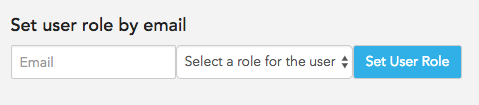

# User Manual - Administrators

1. [Starting Up](#starting-up)
2. [Creating Accounts](#creating-accounts)

## Starting Up
No accounts are created intially in the system. To create the first admin account, first sign up on the site for a student account, then set the `admin` role manually in the database.

## Creating Accounts
Regular student user accounts can be created by public users, however, additional administrator and professor accounts must be initially created from the first administrator account. 

To set a user role, enter the email associated with the desired account in the textbox under the heading 'Set user role by email', select the desired role of the user, and click 'Set User Role'. 

All other Admins and Professors will populate under 'Users with elevated privileges'. You can toggle their roles using the dropdown after each user's email. 

