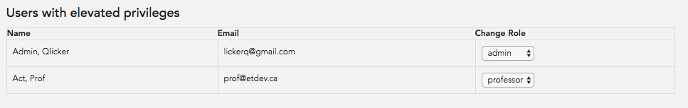

# User Manual - Administrators

1. [Starting Up](#starting-up)
2. [Creating Accounts](#creating-accounts)

## Starting Up
No accounts are created intially in the system. To create the first admin account, first sign up on the site for a student account, then set the `admin` role manually in the database.

## Managing Users

To manage user accounts, select the "Users" tab on the dashboard.

Regular student user accounts can be created by public users, however, additional administrator and professor accounts can be initially created from the first administrator account. 

To set a user role, enter the email associated with the desired account in the textbox under the heading 'Set user role by email', select the desired role of the user, and click 'Set User Role'. 

All other Admins and Professors will populate under 'Users with elevated privileges'. You can toggle their roles using the dropdown after each user's email. 

## Managing Images

To manage image settings, select the "Server" tab on the dashboard.

By default, images are not saved. To set up image storing, select one of the options from the "Image Storage Settings" dropdown. 

Qlicker uses [Slingshot](https://github.com/CulturalMe/meteor-slingshot), a module which allows file transfers to happen between the cloud storage server and the client directly, increasing performance efficiency on Qlicker server. 

### Storing Images on Amazon Web Services

Qlicker uses AWS S3 buckets to store images when selected. More info on S3 can be found [here](https://aws.amazon.com/documentation/s3/). Storing images on S3 will create both a full sized image and a thumbnail when an image is uploaded.

### Storing Images on Microsoft Azure Blobs

Qlicker uses Azure Blobs (located under 'Storage Accounts' in the Azure console). More info on Azure Blobs can be found [here](https://docs.microsoft.com/en-us/azure/storage/blobs/storage-blobs-introduction).

### Storing images locally

By selecting "Local Storage", Qlicker will store image data directly on the server. This is not recommended as it will increase the load on the server.

## Managing Single Sign On

To manage single sign on settings, select the "Single Sign On" tab. Qlicker uses a SAML 2.0 implementation to manage single sign on. 

1. To enable single sign on, click the "Enable Single Sign On" checkbox.

2. Obtain SAML metadata from your institution.
   
3. Enter SAML attributes from metadata.

### SAML Attributes

1. Entry Point: URL to redirect to when logging in.
  
2. Logout URL: URL to redirct to when logging out.

3. Certificate: Public certificate provided by metadata.

4. Identifier Format: Name identifier format to request from identity provider.

5. Institution Name: Name that shows on login page (not found in metadata). 

6. Email Identifier: Format for identifying user emails.

7. First Name Identifier: Format for identifying user first name.

8. Last Name Identifier: Format for identifying user last name.