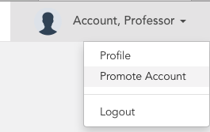
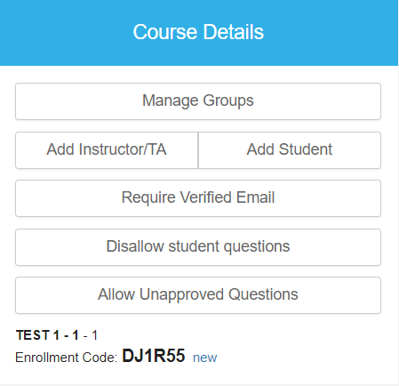
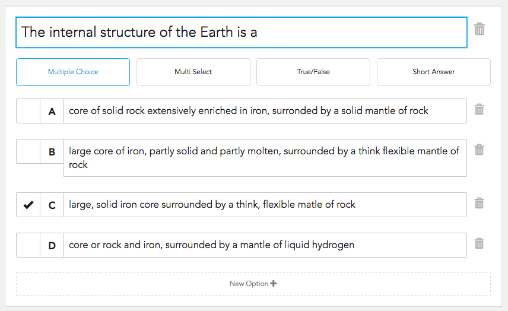
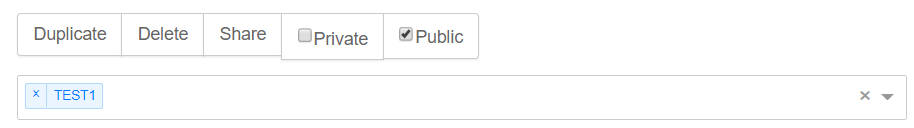
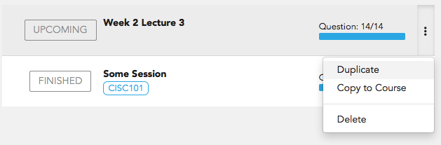
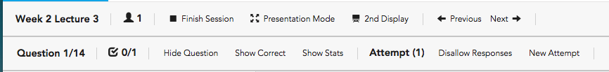

# User Manual - Professors

1. [Starting Up](#starting-up)
2. [Creating Courses](#creating-courses)
3. [Creating Courses](#creating-courses)
4. [Creating Questions](#creating-questions)
5. [Creating Sessions](#creating-sessions)
6. [Running Sessions](#running-sessions)
7. [Viewing Responses](#viewing-responses)

## Starting Up
To obtain an account with professor privileges, another professor or administrator must created your account. Contact a fellow professor or your system administrator.

### Giving others access to a professor account
Access the account promotion menu from the top right of the nav bar. 

Enter an email address of someone with a student account. Their account will be converted to a professor account.

An professor account can create courses and run sessions within their course.

## Creating Courses
There are two ways to create a course; first is by going to the Qlicker Home page and clicking 'Create Course', and second is by selecting 'Courses' in the navigation bar, then 'All Courses', and clicking 'Create Course'.

Enter the following information in the prompt:
+ **Name:** The name of the course
+ **Department Code:** The course's department code (ex. PHYS)
+ **Course Number:** The number of the course (ex. 106)
+ **Section:** The course's section (ex. 001)
+ **Semester:** The current semester (ex F16)

The course should show up on both the Qlicker Home page, and the Courses page.  

### Enrolling Students in Your Courses
To allow students to enrol in one of your courses, you need to provide a 6-digit enrolment code. This can be found under "Course Details" on the course's main page. To get to the course main page, select the desired course in either the Qlicker Home page, the Courses page, or the 'Courses' dropdown menu.

Once there are students enrolled, the "Classlist" section will populate, where you can remove students from the classlist. 

## Creating Questions
Questions can either be created within a [session](#creating-sessions) or by going to the Questions Library via 'My Question Library' in the 'Questions' dropdown menu. Click 'New Question' to create a question.

The question edit form will show up.

+ **Question Field** This is where the question text is entered. The text can be  modified using the toolbar above the form. 
+ **Answers:** There are four different questions types. See below for more details. 

If you are editing they question in your Question Library, you'll see the following items. 

+ **Duplicate:** This button creates a copy of the question
+ **Delete:** This deletes the currently selected question
+ **Make Public/Private:** Public questions can be viewed by any Professor for any course. Private is tied to only to your account. 
+ **Question Tags:** Tags can be added to the question to make searching and selecting questions easier. 

Each edit created will automatically save the question.

#### Question Types 
There are four question types to choose from; multiple choice, multi-select, true or false, and short answer. For multiple choice and multi-select, there can be a max of 6 answers to choose from. Like question text, the answers can be modified using the toollbar. Correct and Incorrect options can be toggled by clicking on the checkbox to the right of each answer.

### Using the Question Library
The Question Library can be found via the 'Questions' dropdown menu. This page contains all questions saved to the library, for all courses you own. On this page, you can create new questions, search for questions using keywords, type, or tags, and access Public and Student-submitted questions.

### Public Questions
Public questions can be accessed by clicking 'Public Questions' at the top of the Question Library page. Public questions are all questions submitted by other users that were marked as public. These questions can be searched using keywords, question type, and tags.

To copy a public question to your library, select the desired question from the list and click 'Copy to Library' above the question preview. The copied question can now be modified, and used in your sessions.

### Student Submissions
Student-submitted questions can be accessed by clicking 'Student Submissions' at the top of the Question Library page. Student-submitted questions are automatically tagged with the department code and course number of the course they submitted the question to. These questions can be searched using keywords, question type, and tags. By default, if an instructor has not approved or made the student question public, the student retains ownership of the question, allowing them to delete it.

To copy a student-submitted question to your library, select the desired question from the list and click 'Copy to Library' above the question preview. The copied question can now be modified, and used in your sessions. The question submitted by the student will be associated with a course (not just because of the tag). By copying it to your library, you are "approving it" for the course, so it will also show up in the library of all instructors for the course, who will be allowed to modify it.

By copying the question, you preserve the information about who created the question, but you take over the ownership. The student that originally submitted the question, can still see the question, and any edits that you make to it. If you un-approve the question, it will no longer show up for the other instructors in the course. If you subsequently delete it, this will remove it from your library by switching the ownership back to the original student.

You can also choose to make a student submission public. This will also transfer the ownership to you, preventing the student from deleting the question, and will "approve the question", although it will not show up in your library because the public flag is set. If you copy it to your library, a copy is made, and since it is approved for the course, all instructors of the course will be able to see it.

## Creating Sessions
Course sessions are the means of getting the questions out to your students. To create a session, go to the course's main page and click 'Create Course'. To get to the course main page, select the desired course in either the Qlicker Home page, the Courses page, or the 'Courses' dropdown menu.

Enter the following information in the prompt:
+ **Name:** The name of the session. We would recommend naming it by the date you're expecting to run this session.
+ **Description:** A description of the session.

The created session will show up under the "Sessions" section as a draft.

### Editing Sessions
To edit a session, select the session under the "Sessions" section of the course main page. This will bring you to the Edit Session page. 

The intial view shows the current questions assigned to the session and various options for the session. These options include running the session, assigning a date to the session, changing the name or description of the session, adding tags to the session, and labelling the session as either a Draft - where student's cannot see it, Upcoming - where student's can see it, but not interact with it, Live, or Inactive. Questions existing in the session can be removed, duplicated, and dragged to change the order. 

You can also add new questions directly to the session from this view. 

Selecting 'Question Library' brings up a list of all questions in your library. You can also select Public Questions, or Student Submissions from the first dropdown selection. Questions can be searched by keyword, type, or tag. To add an existing question to the session, click on the desired question in the list and it will be copied into the session.

### Copying Session
Once sessions are populated in the "Sessions" section, you can delete the session, duplicate it to the current course, and copy it to another course you own. 

## Running Sessions
Running a session means that students are able to interact with and contribute responses to the session. To run the session, go to the Edit Session page and click 'Run Session'.

The current view shows an aggregation of response results and a question preview of the current session underneath a toolbar. The toolbar includes an indication of how many students are active in the session, how many students responded to the current question, and various actions. The results will auto-update once students submit responses. 

The current question can be toggled either by selecting the desired question in the question list, or by clicking 'Previous' or 'Next' to move one question ahead or behind the current question.

In order from left to right starting at the top, the toolbar contains:
+ **Session Name**
+ **Participants:** Current number of students active in the session.
+ **Finish Session:** This closes the session. Session results can now be viewed. 
+ **Presentation Mode:** See below.
+ **2nd Display:** See below.
+ **Previous:** Displays the question before the current question.
+ **Next:** Displays the question after the current question.
+ **Question:** Displays the current question, out of all questions listed in the session.
+ **Answered:** Current number of submissions to the current question, out of all students active in the session. 
+ **Hide Question:** Students will be unable to see the current question.
+ **Show Correct:** The question display, both on your screen and the students, will display the correct answer(s) in green text and the incorrect answer(s) in red text. 
+ **Show Stats:** The question display, both on your screen and the students, will display the current statistics (percentage answered for each option) of the current question
+ **Attempt:** Displays the current attempt for the current question.
+ **Disallow Responses:** This disallows students to submit any more answers to the current question. 
+ **New Attempt:** This allows you to ask the same question again, with a new set of responses.

To end the session select 'Finish Session'. This changes the session to Finished, and results and statstics from the session can be viewed either by clicking 'Review Session Results' under the "Sessions" section in the course's main page, or by selecting 'Response Results' in the nagivation bar and choosing the desired course. 

### Presentation Mode
Presentation Mode is for when your current display is visible by the students. This mode hides the Question sidebar and the results of the current question. To toggle this mode, select 'Presentation Mode' in the toolbar. 

### Dual Display Mode
Dual Display Mode is to be used when there is a second screen used to display information. To toggle this mode, select '2nd Display'. A second window will open with only the current question displayed. You can then use this on a second display.

## Viewing Responses
There are two ways to review session results; one is to select 'Response Results' from the navigation bar, then select the course. The second way is to go to the course home page and select 'Review Session Results'. 

The current view showcases the percentage of questions answered by each student per session. To see the results per session, click 'Participation by Session'. This view displays each session that has results with the number of students that were active in the session, and a list of questions and the number of responses each question received. Clicking on each individual question shows a table with all students that answered the question and a graph showing the distribution of the answers received. 
