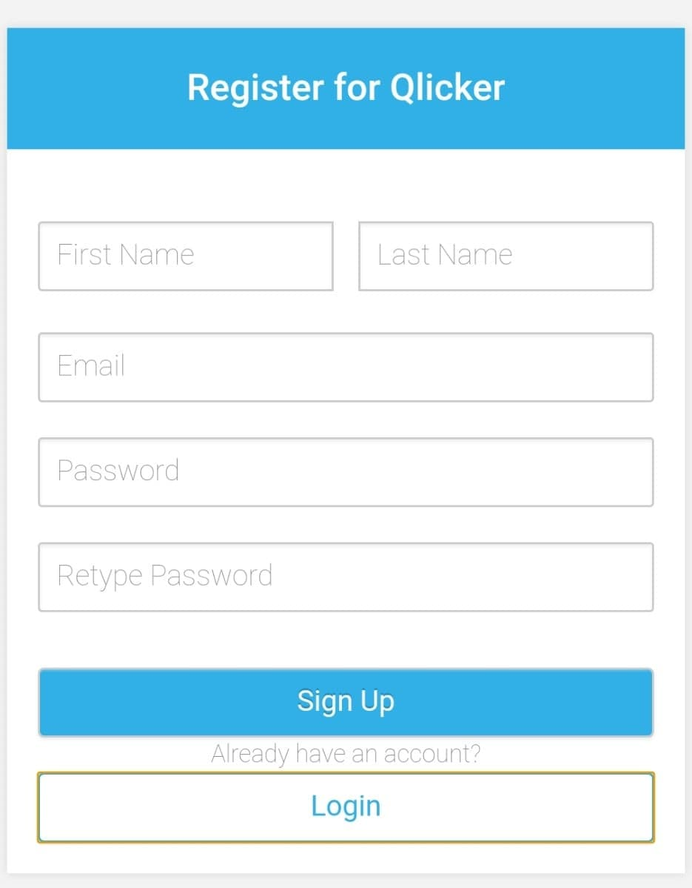
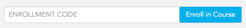
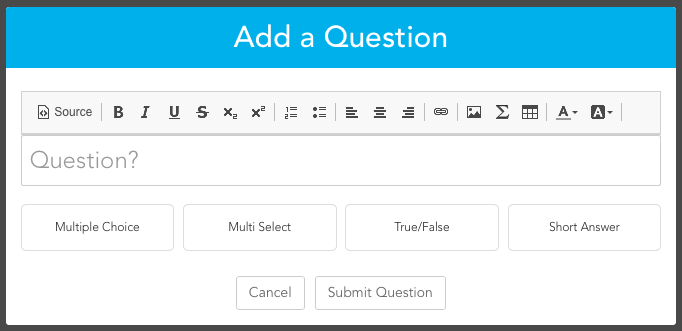
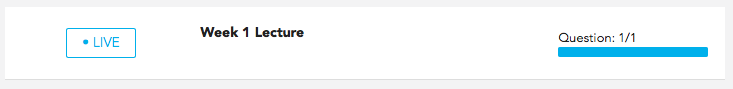
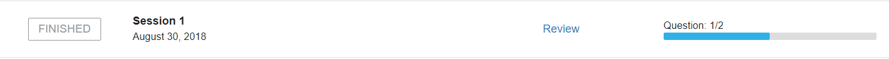

# User Manual - Administrators

1. [Creating an Account](#creating-an-account)
2. [Enrolling in Courses](#enrolling-in-courses)
3. [Submitting Questions](#submitting-questions)
4. [Sessions](#sessions)
5. [Checking Participation](#checking-participation)

## Creating an Account
To create an account, go to the Qlicker login page and click 'Create an Account'. 

Enter the following information (* indicates mandatory fields):
+ **Profile Picture:** Upload a picture of yourself. Note that all pictures will be forced to a square.
+ **First Name** 
+ **Last Name** 
+ ***Email**: Enter your academic email here.
+ ***Password** 

Once all the details are entered, click 'Sign Up'. You will be redirected to the Qlicker home page. Be sure to check your email to verify your Qlicker account.

## Enrolling in Courses
To enroll in a course, you must receive a 6-digit alphanumeric code from a Professor. On the Qlicker home page, enter the enrolment code in the textbox at the top of the page and click 'Enroll in Course'. The course will display on the page once enrolment is successful. 

Each course can be accessed by clicking on the courses heading in the Qlicker home page, or by selecting the desired course under "Courses" in the navigation bar. 

In each courses page, you can submit questions, access Live sessions, and view results of Finished sessions. 

## Submitting Questions
Student questions submissions can only be done in a specific course. To submit a question, go to the desired course's home page via either the "Courses" tab in the navigation bar or from the Qlicker home page. Click 'Submit Question' on the course page. 

The question edit form will show up.

+ **Question Field:** This is where the question text is entered. The text can be modified using the toolbar above the field.
+ **Answers:** There are four different questions types; multiple choice, multi-select, true or false, and short answer. For multiple choice and multi-select, there can be a max of 6 answers to choose from. Like question text, the answers can be modified using the toollbar. Correct and Incorrect options can be toggled by clicking on the checkbox to the right of each answer.

To submit the question to the course click 'Submit Question'.

## Sessions
Students can only participate in Live sessions. When a Live session shows up either on the Qlicker home page or the course's page, select it to join the session. 

Professors have the ability to hide questions or disallow responses, so please listen to the Professor for details for each session.

When a question is active, you can answer it by selecting a multiple choice or true/false option, selecting multiple options if the question is multi-select, or entering text in a field if the question is short answer. Once an option is selected, the 'Submit' button will be enabled. To submit your selection, click on the 'Submit' button. You cannot change an answer after submitting it. After clicking 'Submit', a success message will show up, and the button will say 'Submitted'. 

## Checking Participation
After finishing a session, the session will show up under the course's page as Finished. Select a Finished session to view participation grades.

The statistics are number of answers submitted based on the questions asked in the session. 
